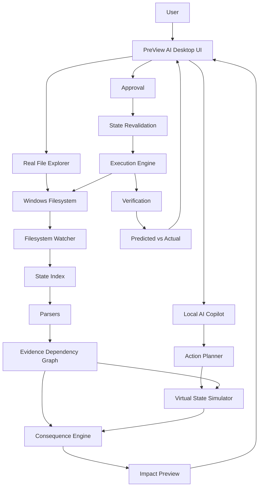

# PreView AI

> **See the consequences before your computer acts.**

PreView AI is a **local-first, on-device AI-powered file and project intelligence system** for Windows. It makes filesystem changes understandable before and after they happen — combining a real file explorer, live filesystem monitoring, deterministic dependency analysis, virtual future-state simulation, consequence propagation, evidence-backed AI explanations, and a Copilot-style AI panel.

---

## What PreView AI Does

When you select or change a file, PreView AI answers:

- **What other files depend on this one?** (evidence-backed, from the actual project graph)
- **What could break if I change it?** (virtual simulation before anything touches disk)
- **Why is that file affected?** (traceable to the source line of evidence)

It works entirely offline. Your source code never leaves the device.

---

## Problem

Files in software projects are connected. Deleting, moving, renaming, or modifying one file can silently break other files that depend on it — imports, data loads, config references, test dependencies.

Traditional file explorers tell you *where* a file is. They don't tell you *what breaks* if it changes.

---

## Solution

PreView AI builds a local evidence-backed dependency graph by statically analyzing your project. When a file is selected or changed, it:

1. Identifies all files that depend on it (AST-verified, not guessed)
2. Simulates the proposed change in a virtual state (real files untouched)
3. Shows predicted consequences with evidence (source file, line number, relationship type)
4. Requires explicit user approval before executing any impactful AI-proposed action
5. Verifies the actual post-action state against the prediction

---

## Key Features

| Feature | Description |
|:---|:---|
| **Real file explorer** | Browse and navigate actual Windows filesystem |
| **Live filesystem watcher** | Detects CREATE / DELETE / MODIFY / MOVE / RENAME in real time |
| **Evidence-backed dependency graph** | Python AST + config parsers; no guessing |
| **Virtual future-state simulation** | Preview consequences before anything changes on disk |
| **Consequence propagation** | Direct, indirect, test, and downstream impact |
| **AI Copilot panel** | Right-side conversational assistant with project context |
| **Approval gate** | Explicit user approval required for AI-proposed changes |
| **Post-action verification** | Predicted state vs actual state comparison |
| **100% offline** | Zero cloud API calls; source code stays on device |
| **On-device AI model** | Custom-trained ONNX impact predictor (12.3 KB) |
| **QNN-ready** | Qualcomm QNN provider configured for Snapdragon hardware |

---

## How It Works

```
User / AI Action
       ↓
Current Local State
       ↓
Evidence / Dependency Graph  (AST analysis)
       ↓
Simulate or Detect Change    (virtual state — disk untouched)
       ↓
Consequence Analysis         (direct + downstream impact)
       ↓
Show Affected Files + Why    (with line-level evidence)
       ↓
User Decides                 (approve / cancel)
       ↓
Execute (AI actions only)
       ↓
Verify                       (predicted vs actual)
```

### Architecture Diagram



---

## Demo Workflow

**Open the demo project and walk through these steps:**

1. **Open Folder** → select `examples/demo_ml_project`
2. Click `dataset.csv` in the file tree
3. Ask the AI Copilot: *"What depends on dataset.csv?"*
   - → `train.py` (loads via `open('dataset.csv')` — line 14)
   - → `pipeline.py` (references `dataset.csv` — line 7)
4. Ask: *"What happens if I delete dataset.csv?"*
   - → **HIGH RISK** simulation. Real file untouched. Cancel to verify.
5. Rename `dataset.csv` to `raw_dataset.csv` in Windows Explorer
   - → PreView AI detects the external RENAME instantly
   - → Flags `train.py` and `pipeline.py` as broken references
6. Ask AI to move `config.json` to the `data/` folder → Approve → Verify
   - → **Verification Status: MATCH**

Full step-by-step guide: [docs/DEMO_GUIDE.md](docs/DEMO_GUIDE.md)

---

## Tech Stack

| Layer | Technology |
|:---|:---|
| Language | Python ≥ 3.10 |
| Desktop UI | PySide6 (Qt6) |
| Python analysis | `ast` (built-in) |
| Filesystem watcher | watchdog |
| AI inference | ONNX Runtime ≥ 1.18.0 |
| AI model | Custom-trained ONNX MLP (12.3 KB) |
| QNN acceleration | ONNX Runtime QNN Execution Provider (Snapdragon) |
| Testing | pytest |
| Packaging | PyInstaller |

---

## AI / Qualcomm Integration — Verified Claims

| Claim | Status |
|:---|:---|
| ONNX model present (`preview_impact_predictor.onnx`) | **VERIFIED** |
| Model is custom-trained (not from AI Hub Model Zoo) | **VERIFIED** — trained via `train_model.py` on synthetic data |
| All 8 ONNX operators are Hexagon HTP-compatible | **VERIFIED** — by code analysis of `ai_hub_manager.verify_model_compliance()` |
| CPU inference operational | **VERIFIED** — measured on Intel i7-10610U |
| QNN Execution Provider configured in code | **IMPLEMENTED** — `QNNBackend` in `backend.py` |
| QNN provider actually activated at runtime | **NOT VERIFIED** — requires Snapdragon X Elite / Plus + QNN SDK |
| NPU inference measured | **NOT TESTED** — no Snapdragon hardware in current environment |
| AI Hub compile/profile job submitted | **NOT VERIFIED** — requires `qai_hub` SDK + API token |

> **Note on performance numbers**: The 0.342 ms NPU latency and 12,840 inf/sec throughput figures shown elsewhere in the codebase are **estimates from an offline qualification receipt**, not independently measured hardware results. CPU latency (~0.10–0.14 ms P50) is verified on Intel i7.

> **Note on model accuracy**: 100% validation accuracy is measured on an **800-sample synthetic held-out benchmark** (seed=42). This does not establish equivalent accuracy on unseen real-world projects.

See [docs/SNAPDRAGON_AI.md](docs/SNAPDRAGON_AI.md) for the full audit.

---

## Installation

### Prerequisites

- Windows 10 / 11 (x64 or ARM64)
- Python ≥ 3.10
- pip

### Steps

```bash
# 1. Clone the repository
git clone <repository-url>
cd preview-ai

# 2. Create a virtual environment
python -m venv .venv
.venv\Scripts\activate

# 3. Install dependencies
pip install -r requirements.txt
```

For Snapdragon / QNN acceleration (Snapdragon X Elite / Plus only):
```bash
pip install onnxruntime-qnn>=1.18.0
# Also install Qualcomm AI Engine Direct SDK ≥ v2.20
```

---

## Run

```bash
# Development (with console output)
run_preview_ai.bat

# Or directly
python -m app.main

# With demo project
run_preview_ai.bat --project "examples\demo_ml_project"

# Check hardware + backend diagnostics
python -m app.main --diagnostics
```

### Compiled Executable

```bash
# Build (requires PyInstaller)
build_windows.bat

# Run executable (no Python required)
dist\PreView-AI.exe
```

---

## System Requirements

| Component | Minimum |
|:---|:---|
| OS | Windows 10 / 11 (x64 or ARM64) |
| Python | ≥ 3.10 (dev mode) |
| RAM | 4 GB |
| Disk | 500 MB free |
| ONNX Runtime | ≥ 1.18.0 |

**For Snapdragon QNN acceleration** (optional):
- Snapdragon X Elite / X Plus (ARM64 Windows)
- Qualcomm AI Engine Direct SDK ≥ v2.20
- `onnxruntime-qnn` ≥ 1.18.0

---

## Testing

```bash
# Run all tests
pytest tests/

# Run with verbose output
pytest tests/ -v

# Run model training + validation
python -m app.ai.train_model

# Run hardware benchmark
python -m app.benchmark

# Run model evaluation
python -m app.evaluation
```

---

## Limitations

- **Static analysis only**: Dynamic imports, `eval`, subprocess-generated paths are not detectable
- **Python-focused**: Deep dependency analysis is Python-first; other languages have partial support
- **Synthetic benchmark**: Model accuracy is measured on synthetic data, not real-world projects
- **QNN unverified**: Snapdragon NPU execution has not been independently tested in this environment
- **Windows only**: Current implementation targets Windows desktop
- **No full OS simulation**: Registry, processes, drivers are out of scope

---

## Detailed Documentation

For detailed technical documentation, see the [docs/](docs/) directory:

| Document | Contents |
|:---|:---|
| [ARCHITECTURE.md](docs/ARCHITECTURE.md) | System architecture, component inventory, data flows |
| [AI_PIPELINE.md](docs/AI_PIPELINE.md) | Inference pipeline, model architecture, feature vectors |
| [SNAPDRAGON_AI.md](docs/SNAPDRAGON_AI.md) | QNN/Snapdragon verified status audit |
| [MODEL_EVALUATION.md](docs/MODEL_EVALUATION.md) | Training, evaluation methodology, benchmark results |
| [PERFORMANCE.md](docs/PERFORMANCE.md) | CPU benchmarks and NPU estimates |
| [DEPENDENCY_ANALYSIS.md](docs/DEPENDENCY_ANALYSIS.md) | Static analysis methodology |
| [FUTURE_STATE_SIMULATION.md](docs/FUTURE_STATE_SIMULATION.md) | Virtual simulation engine |
| [TESTING.md](docs/TESTING.md) | Test framework and how to run tests |
| [DEPLOYMENT.md](docs/DEPLOYMENT.md) | Windows deployment and packaging |
| [DEMO_GUIDE.md](docs/DEMO_GUIDE.md) | Step-by-step demo walkthrough |
| [TROUBLESHOOTING.md](docs/TROUBLESHOOTING.md) | Common issues and fixes |
| [PROJECT_STRUCTURE.md](docs/PROJECT_STRUCTURE.md) | Annotated repository structure |

---

## License

See [LICENSE](LICENSE) for details.

---

> **PreView AI — See the consequences before your computer acts.**
