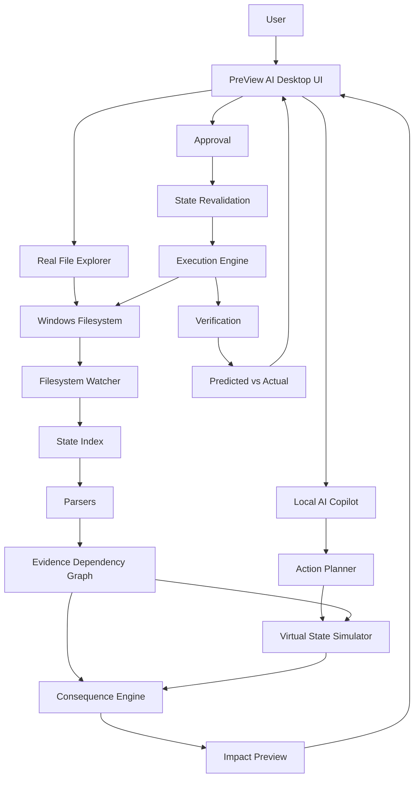

# PreView AI — Architecture

## 1. High-Level Architecture

```
                         PREVIEW AI
                             │
              ┌──────────────┴──────────────┐
              │                             │
        FILE EXPLORER                  AI COPILOT
              │                             │
        Real filesystem               Natural language
              │                             │
              └──────────────┬──────────────┘
                             ▼
                        STATE MODEL
                             │
                             ▼
                     EVIDENCE GRAPH
                             │
                ┌────────────┴────────────┐
                ▼                         ▼
          USER-MADE CHANGE           AI ACTION
                │                         │
                ▼                         ▼
             WATCHER                 SIMULATOR
                │                         │
                └────────────┬────────────┘
                             ▼
                     CONSEQUENCE ENGINE
                             │
                             ▼
                    AFFECTED FILES + WHY
                             │
                             ▼
                        USER DECISION
                             │
                             ▼
                           EXECUTE
                             │
                             ▼
                           VERIFY
```

---

## 2. System Architecture Diagram



---

## 3. Component Inventory

### UI (`app/ui/`)
- Main window — `app/main.py` (PySide6 QMainWindow)
- File explorer tree (QTreeView / QFileSystemModel)
- File detail / content panel
- Consequence graph widget
- AI side panel (Copilot)
- Event stream / telemetry
- Approval controls

### State (`app/state/`)
- Filesystem scanner with mtime/size incremental filtering
- Filesystem watcher (watchdog)
- Normalized path model
- State index

### Parsing (`app/parsing/`)
- Python AST parser — imports, function calls, symbol references
- Config/reference parser — JSON, YAML, TOML, plain text references
- Reference detector — string-path matches

### Graph (`app/graph/`)
- Node model — files, modules, configs
- Edge model — IMPORT, LOAD, READ, REFERENCE, CALL
- Evidence model — source line, raw text, confidence
- Graph traversal — direct dependents, downstream BFS

### Simulation (`app/simulation/`)
- Virtual state — isolated copy of graph state
- Action simulation — DELETE, MOVE, RENAME, MODIFY on virtual state
- State diff — ADDED, REMOVED, MOVED, RENAMED, MODIFIED, RELATIONSHIP_*

### Consequence (`app/consequence/`)
- Impact classifier — DIRECT, DEPENDENCY, REFERENCE, DOWNSTREAM, PREDICTED, UNCERTAIN
- Propagation engine — BFS from changed node
- Risk evaluator — SAFE, LOW, MEDIUM, HIGH, BLOCKED
- Uncertainty handler — incomplete analysis labeling

### AI (`app/ai/`)
- `backend.py` — hardware detection, QNN/CPU provider selection
- `impact_predictor.py` — orchestrates inference pipeline
- `context_builder.py` — builds 16-feature vectors from graph
- `model_manager.py` — model path resolution, auto-generation
- `model_builder.py` / `train_model.py` — model training + ONNX export
- `ai_hub_manager.py` — AI Hub compliance check + compilation tools
- `intent_parser.py` — natural language → structured action
- `assistant_router.py` — routes user queries to analysis functions
- `explanation.py` — evidence-grounded natural language explanation

### Execution (`app/execution/`)
- Validation — scope containment, action legality
- Approval gate — explicit user approval required
- Executor — real filesystem operations
- Audit log

### Verification (`app/verification/`)
- Rescan after execution
- State diff: predicted vs actual
- Mismatch detection and reporting

---

## 4. Data Flow

### A. Initial project load

```
Folder selection
 ↓
Root validation
 ↓
Initial scan (mtime + size)
 ↓
Language/project detection
 ↓
AST + config parsing
 ↓
State index update
 ↓
Dependency/evidence graph construction
```

### B. User-made change

```
OS filesystem event
 ↓
Debounce / coalesce
 ↓
Normalize path
 ↓
Classify change (CREATE/DELETE/MODIFY/MOVE/RENAME)
 ↓
Update state index
 ↓
Update affected graph area
 ↓
Impact propagation
 ↓
Impact report → UI notification / AI panel
```

### C. AI-proposed change

```
Natural language input
 ↓
Intent parser → structured action
 ↓
Validation (scope, legality)
 ↓
Current-state snapshot
 ↓
Virtual simulation
 ↓
Consequence analysis
 ↓
Future-state preview
 ↓
User approval
 ↓
State revalidation
 ↓
Execution
 ↓
Post-action verification
```

---

## 5. Architectural Principle

> **AI should understand intent and explain evidence; deterministic systems should establish filesystem facts and execute safely.**

| AI Layer | Deterministic Layer |
|:---|:---|
| Natural language intent understanding | Filesystem state |
| Structured action extraction | Reference detection |
| Conversational interaction | Dependency graph |
| Evidence-based explanation | Simulation |
| | Consequence propagation |
| | Path validation |
| | Execution |
| | Verification |

---

## 6. Security Architecture

- **Scope boundary**: User-selected root directory defines the safe boundary
- **Path normalization**: `pathlib.Path`, normalized absolute paths, root containment checks
- **State revalidation**: If filesystem changes after preview, the stale preview is invalidated
- **Execution gate**: VALID ACTION + VALID SCOPE + CURRENT STATE VERIFIED + USER APPROVAL = EXECUTABLE ACTION
- **Path traversal protection**: Rejects `..` traversal and malformed targets

---

## 7. Repository Structure

```
preview-ai/
├── README.md
├── requirements.txt
├── pyproject.toml
├── run_preview_ai.bat
├── build_windows.bat
│
├── app/
│   ├── ai/              ← AI inference, backend, model training
│   ├── consequence/     ← Impact classification and propagation
│   ├── execution/       ← Approval, execution, audit
│   ├── graph/           ← Node, edge, evidence, traversal
│   ├── parsing/         ← AST and config parsers
│   ├── safety/          ← Scope validation, safety guardrails
│   ├── simulation/      ← Virtual state, action simulation, diff
│   ├── state/           ← Scanner, watcher, index
│   ├── ui/              ← PySide6 UI components
│   ├── verification/    ← Post-action verification
│   └── main.py          ← Application entry point
│
├── models/
│   └── preview_impact_predictor.onnx   ← Trained impact predictor
│
├── tests/               ← pytest unit + integration tests
├── examples/            ← Demo ML project fixture
├── docs/                ← Technical documentation
└── dist/                ← Built executables
```

For detailed documentation of each subsystem, see the relevant file in `docs/`.
